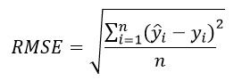
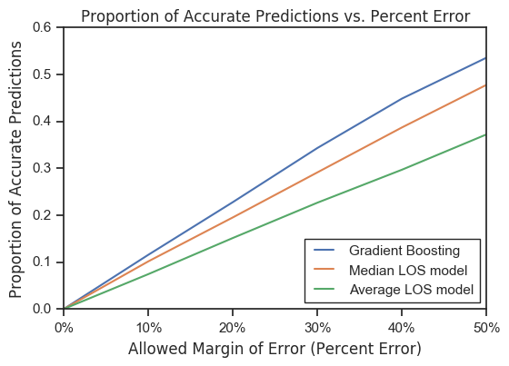

# Predicting hospital length-of-stay at time of admission

**Medium Story**: https://medium.com/@daniel.j.cummings/predicting-hospital-length-of-stay-at-time-of-admission-55dfdfe69598   

## Project Overview

Predictive analytics is an increasingly important tool in the healthcare field since modern machine learning (ML) methods can use large amounts of available data to predict individual outcomes for patients. For example, ML predictions can help healthcare providers determine likelihoods of disease, aid in diagnosis, recommend treatment, and predict future wellness. For this project, I chose to focus on a more logistical metric of healthcare, hospital length-of-stay (LOS). LOS is defined as the time between hospital admission and discharge measured in days.

**The goal of this project is to create a model that predicts the length-of-stay for each patient at time of admission.** The project makes use of the [MIMIC](https://mimic.physionet.org/) database: "MIMIC is an openly available dataset developed by the MIT Lab for Computational Physiology, comprising de-identified health data associated with ~40,000 critical care patients. It includes demographics, vital signs, laboratory tests, medications, and more."

## Summary of Results

I fit five different regression models (from the scikit-learn library) using default settings and compared the r-squared (R2) scores. The GradientBoostingRegressor took the win with an R2 score of ~37% with the testing set so I decided to focus on refining this particular ensemble model. The root mean squared error (RMSE) was used to compare the prediction model versus the industry standard average and median LOS metrics. The gradient boosting model RMSE is better by more than 24% (percent difference) versus the constant average or median models.



Another way I looked at the model was to plot the proportion of accurate predictions in the test set versus an allowed margin of error. Other studies qualify a LOS prediction as correct if it falls within a certain margin of error. It follows that as the margin of error allowance increases, so should the proportion of accurate predictions for all models. The gradient boosting prediction model performs better than the other constant models across the margin of error range up to 50%.




## Getting Started

Cloning the git repository and installing the provided packages will help you get a copy of the project up and running on your local machine. The analysis for this project was performed using Jupyter Notebook (.ipynb) and the packages were managed using the Ananconda platform. 

```
git clone https://github.com/daniel-codes/hospital-los-predictor
pip install -r /path/to/requirements.txt
```

File Description:
* hospital_los_prediction.ipynb - Jupyter Notebook for this project including data exploration, feature engineering, and prediction modeling
* requirements.txt - packages used to perform this analysis   
* environment.yml - Anaconda environment file (alternative to requirements.txt)

\*note: The MIMIC database has special access requirements so I am not able post the source dataset in this REPO. If you are granted access, as of 12/15/2018, the filenames will be listed exactly as:
* ADMISSIONS.csv.gz - Admissions information including admission time, discharge time,  ethnicity, religion, insurance, and admission type
* PATIENTS.csv.gz - Patient specific info such as gender and de-identified date of birth
* DIAGNOSES_ICD.csv.gz - ICD-9 diagnosis for each admission to hospital
* ICUSTAYS.csv.gz - Intensive Care Unit (ICU) ward information for each admission to hospital

## Authors

- **Daniel Cummings** - [daniel-codes](https://github.com/daniel-codes)

## License

This project is licensed under the MIT License - see the [LICENSE.md](LICENSE.md) file for details

## Acknowledgments

MIMIC-III, a freely accessible critical care database. Johnson AEW, Pollard TJ, Shen L, Lehman L, Feng M, Ghassemi M, Moody B, Szolovits P, Celi LA, and Mark RG. Scientific Data (2016). DOI: 10.1038/sdata.2016.35. Available from: http://www.nature.com/articles/sdata201635

I found these resources particularly helpful for this project: 
- https://towardsdatascience.com/running-random-forests-inspect-the-feature-importances-with-this-code-2b00dd72b92e
- https://matplotlib.org/examples/api/barchart_demo.html
- https://stackoverflow.com/questions/46168450/replace-specific-range-of-values-in-data-frame-pandas
- https://en.wikipedia.org/wiki/Root-mean-square_deviation
- https://en.wikipedia.org/wiki/Coefficient_of_determination
- https://www.theanalysisfactor.com/assessing-the-fit-of-regression-models/
- https://www.healthcatalyst.com/success_stories/reducing-length-of-stay-in-hospital
- http://bok.ahima.org/Pages/Long%20Term%20Care%20Guidelines%20TOC/Practice%20Guidelines/Reporting